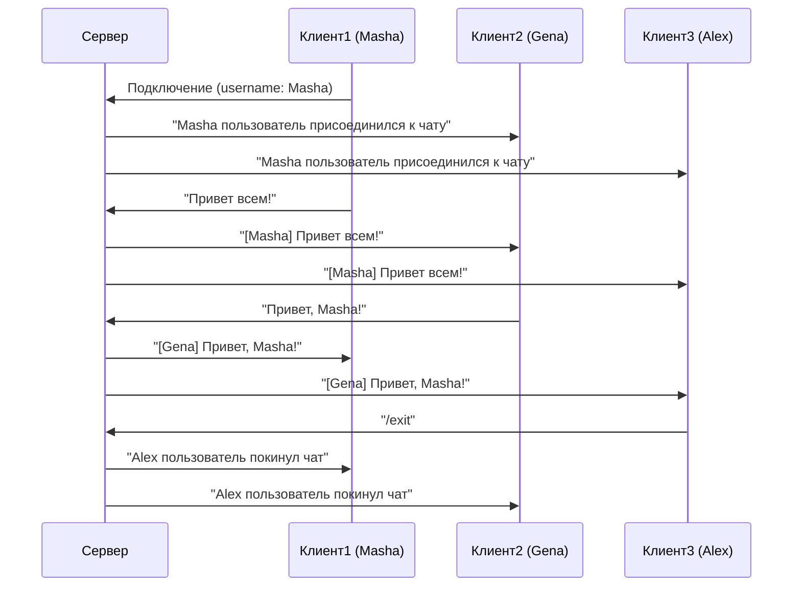

# 🚀 Консольный чат (TCP) на Java
## 📌 Оглавление
1. [Архитектура](#-архитектура)
2. [Схема взаимодействия](#-схема-взаимодействия)
3. [Запуск](#-запуск)

## 🏗 Архитектура

### Основные компоненты
| Компонент       | Описание                                                    |
|-----------------|-------------------------------------------------------------|
| `ChatServer`    | Центральный сервер, управляющий подключениями и сообщениями |
| `ChatClient`    | Клиентское приложение для подключения к чату                |
| `ClientApp`     | Запуск клиента                                              |
| `ServerApp`     | Запуск сервера                                              |
| `Message`       | Модель данных для сообщений (отправитель, текст, timestamp) |
| `ChatConstants` | Централизованное хранение всех констант и настроек          |

## 🔄 Схема взаимодействия

## 🚀 Запуск

#### Запуск сервера:
Class: server.ServerApp

#### Запуск клиентов (в отдельных терминалах):
Class: client.ClientApp
##### Терминал 1:
> Введите свое имя: Masha

##### Терминал 2:
> Введите свое имя: Gena

##### Терминал 3:
> Введите свое имя: Alex